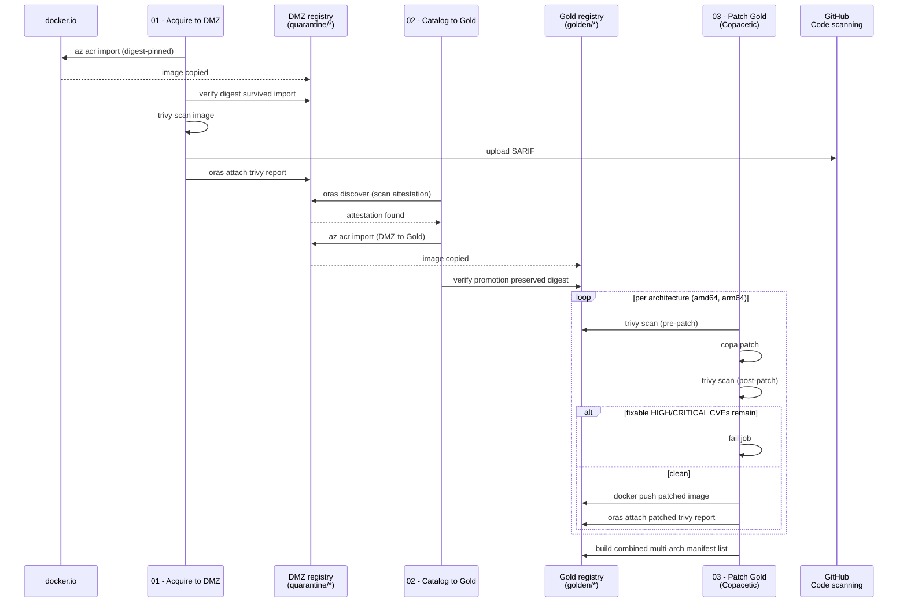

# Demo

## Overview

This shows a basic implementation of the [Microsoft Containers Secure Supply Chain](https://learn.microsoft.com/en-us/azure/security/container-secure-supply-chain/articles/container-secure-supply-chain-implementation/containers-secure-supply-chain-overview) framework.

There are two Azure Container Registries. One DMZ, the other "golden." The DMZ acquires insecure images. At which point they can be Cataloged and promoted to the Golden ACR, and then paatching can be done continuously to ensure no OS level CVEs. 


```bash
# Create the azd env
azd env new dev

azd env set AZURE_SUBSCRIPTION_ID <your azure sub id>
azd env set AZURE_TENANT_ID <your azure tenant id>
azd env set AZURE_LOCATION westus3
azd env set GITHUB_REPO_NAME copacetic-demo
azd env set GITHUB_OWNER_NAME zachbugay
```

## Verify

```bash
dmz_acr_name=""
golden_acr_name=""

# On the dmz acr, there should be limited tags.
az acr repository show-tags \
    --name $dmz_acr_name \
    --repository quarantine/nginx -o table

# Output the digest value for the image.
az acr manifest show-metadata \
    --registry $dmz_acr_name \
    --name quarantine/nginx:1.21.6 \
    --query digest -o tsv

# Store the digest
container_digest=""

# Use oras cli to view the report
oras discover \
    --format json \
    --artifact-type application/vnd.copacetic-demo.trivy.report.v1+json \
    ${dmz_acr_name}.azurecr.io/quarantine/nginx@${container_digest}

# On the golden acr, after copa runs, should see more tags added.
az acr repository show-tags \
    --name $golden_acr_name \
    --repository golden/nginx -o table
# However, the sha is still the same.
az acr manifest show-metadata \
    --registry $golden_acr_name \
    --name golden/nginx:1.21.6 --query digest -o tsv
```
